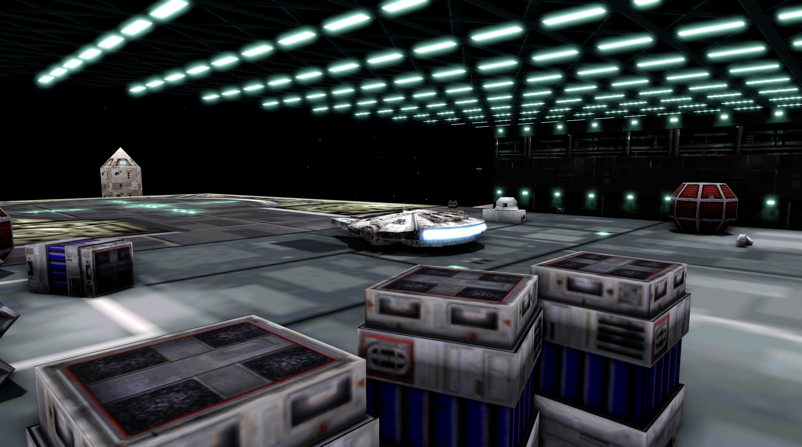

# OpenXWA



OpenXWA is a portable, source-level reimplementation of the *Star Wars:
X-Wing Alliance* engine. Its goal is to preserve the original game's behavior,
data formats, simulation, user interface, and classic rendering while also
providing an additional modern renderer and a native runtime for current
operating systems.

> [!IMPORTANT]
> OpenXWA is an engine only. It does not include any of the original missions,
> models, textures, sounds, music, movies, or other copyrighted game content.
> A complete copy of the original *X-Wing Alliance* game data is required.

## What OpenXWA offers

### Faithful engine reimplementation

OpenXWA reimplements the original executable subsystem by subsystem, using the
original algorithms, data layouts, timing rules, and file formats as its
reference. This includes the frontend, mission and flight simulation, AI,
objects and weapons, HUD, input, audio, movies, and the original rendering
interfaces.

The classic renderer preserves the game's palette-driven 2D presentation,
framebuffer and cockpit composition, OPT material behavior, lighting laws, and
DirectDraw/Direct3D-era draw semantics. Those interfaces are translated to a
portable SDL3 GPU backend rather than requiring the original Windows graphics
APIs.

### Modern renderer

The modern renderer consumes the same authoritative game state as the classic
renderer. It can use the original OPT models directly, while also supporting
optional remastered models, textures, interface art, and videos.

Implemented rendering features include:

- cascaded directional shadows, point lights, SSAO, bloom, and motion blur;
- native 16:9 Hor+ flight rendering at the physical presentation resolution;
- AMD FidelityFX FSR 3.1 temporal AA and upscaling;
- anisotropic texture filtering;
- HDR output when supported by the display and graphics backend;
- physically based material support for remastered assets;

Press `F5` at runtime to switch between the HD and classic views. Press `F2` to
toggle between split comparison (classic left, HD right) and the currently
selected HD or classic view.

### Other modern features

- high-rate single-player flight simulation for smoother response on modern
  displays, with an optional classic timing mode;
- resolution-independent presentation and window resizing;
- keyboard, mouse, joystick, and gamepad input through SDL3;
- portable audio and original movie playback;
- optional runtime replacement of individual models, 2D assets, and movies
  without modifying the original data.

## Current state

OpenXWA is under active development and is not yet a complete drop-in
replacement for the original game. Substantial frontend, mission, flight,
rendering, input, audio, and movie functionality is implemented, and both the
classic and modern rendering paths are usable.

Some screens, compatibility edge cases, and visual details still need work.
Network multiplayer transport is not implemented; current development is
focused on the local and single-player engine paths. Expect regressions and
incomplete behavior while the reimplementation progresses.

## Requirements

### Original game data

On first launch, OpenXWA asks for the directory containing the prepared
original game data and remembers the selection. The selected directory must
contain the full contents of both CD 1 and CD 2 of the original game, combined
under one root directory. OpenXWA does not provide these files.

For unattended and development launches, the directory can be selected with:

```sh
OpenXWA --game-data /path/to/xwa-data
```

### System requirements

- a 64-bit system;
- a modern GPU with current drivers;
- keyboard and mouse;
- a joystick or gamepad for flight;
- the original *X-Wing Alliance* game data described above.

Release packages carry their required SDL3, FFmpeg, and compression runtime
libraries. Keep the executable, libraries, resources, and shader directories
together when using a relocatable package.

## Supported platforms

The current build and packaging targets are:

| Platform | Current runtime target | Graphics backend |
|---|---|---|
| Windows | x86-64 | Direct3D 12 or Vulkan |
| macOS | macOS 13 or later, native arm64 or x86-64 build | Metal |
| Linux | x86-64, glibc 2.36 or later | Vulkan |

Packaging validates compilation, shader generation, and dependency staging.
Runtime validation across different GPUs, drivers, and clean operating-system
installations is ongoing.

Platform-specific build and package instructions are available for
[Windows](https://github.com/elyosh/xwa/blob/main/packaging/windows/README.md),
[macOS](https://github.com/elyosh/xwa/blob/main/packaging/macos/README.md), and
[Linux](https://github.com/elyosh/xwa/blob/main/packaging/linux/README.md).

## Building from source

The core build uses CMake 3.20 or later and a C/C++ toolchain. It also requires
SDL3 3.4, zstd, the required FFmpeg components, and SDL_shadercross for
compiling HLSL shaders to Metal, SPIR-V, and DXIL.

The platform packaging scripts and Dockerfiles build pinned dependencies and
produce self-contained application artifacts. They are the recommended
reference for reproducible builds.
